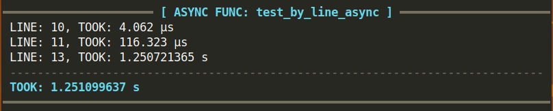

<!--
 Copyright (c) 2023 Anthony Mugendi
 
 This software is released under the MIT License.
 https://opensource.org/licenses/MIT
-->

# wraptimer

- 📖 [Documentation](https://mugendi.github.io/wraptimer/)

An amazing alternative to Python's builtin `timeit` module that allows for high resolution timing of functions as well as in-depth line-by-line timing. It also exposes convenient classes to measure execution time for any arbitrary code.

### Sync function example
```python
# imports
import time
from wraptimer import TimeIt
# Init
timeit = TimeIt()

# decorate
@timeit.byline
def test_by_line():
    a = 10
    b = 20
    time.sleep(0.8)
    c = a + b

    return [a, b, c]

# run
test_by_line()
```
 


### Async function example
```python
# Imports
import asyncio
from wraptimer import TimeIt
# Init
timeit = TimeIt()

# decorate
@timeit.byline
async def test_by_line_async():
    a = 10
    b = 20
    await asyncio.sleep(1.25)

    return [a, b]

# run
asyncio.run(test_by_line_async()) 
```
 


## Don't need Line-by-line tracing?

Use `@timeit.func` if you do not want to print **line-by-line** durations.

```python
...
@timeit.func
async def test_by_line_async():
    a = 10
    b = 20
    await asyncio.sleep(1.25)

    return [a, b]
```

 


## Read the documentation
For more about wraptimer, [Read The Documentation](https://mugendi.github.io/wraptimer/)


